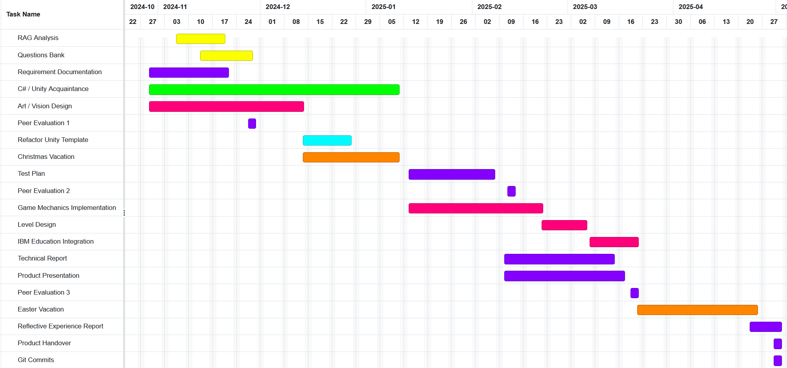

# Requirements Documentation for Shadow Operative

| Name           | CIS username |
| -------------- | ------------ |
| Ben Magowan    | vcwx72       |
| Danial Maqbool | gkzv63       |
| Will Morgan    | sghp78       |
| Edmond Vajda   | njql73       |
| Sami Lodi      | hqcb32       |
| Heria Chen     | qzxl76       |
| Toby Davis     | cltz62       |

- Group Number: 5
- Date the document was prepared:
- Version: 1.0.2

# 1 - Introduction

## 1.1 - Overview and Justification

The purpose of this project is to develop an engaging educational game, based on the CounterSpy universe, that integrates IBM Skills Build content into its gameplay. This approach transforms traditional educational content into an immersive, game-based experience that enhances learner engagement and retention.

It will benefit individuals pursuing IBM Skills Build knowledge, with potential applications for educational institutions or self-learners interested in complementing their studies with an engaging, interactive tool.

The project’s client is IBM, represented by John McManara, who leads IBM UK University Programs and serves as an IBM Master Inventor. IBM aims to make IBM Skills Build content more accessible and engaging through this game.

This document is organised as follows:

- [1 - Introduction](#1---introduction)
  - [1.1 - Overview and Justification](#11---overview-and-justification)
  - [1.2 - Project Scope](#12---project-scope)
  - [1.3 - System Description](#13---system-description)
- [2 - Solution Requirements](#2---solution-requirements)
  - [2.1 - Requirements Elicitation](#21---requirements-elicitation)
  - [2.2 - Behavioural Requirements](#22---behavioural-requirements)
- [3 - Project Development](#3---project-management)
  - [3.1 - Risks and Issues](#31---risks-and-issues)
  - [3.2 - Development Approach](#32---development-approach)
  - [3.3 - Project Schedule](#33---project-schedule)

## 1.2 - Project Scope

### 1.2.1 Purpose and Overall Goals

The primary goal of the Shadow Operative project is to enhance learner engagement and retention by transforming IBM Skills Build concepts into an immersive, interactive gaming experience. By integrating educational content within gameplay, the project seeks to address the limitations of traditional learning methods, such as low engagement and lack of interactivity, with a more innovative and appealing approach.

Through the combination of stealth-based challenges and gamified learning mechanics, the project aims to not only make learning enjoyable but also improve understanding and application of key concepts. The game aspires to serve as a scalable, versatile educational tool that can support a wide range of learners and promote the adoption of IBM Skills Build across diverse educational environments.

### 1.2.2 Stakeholders

- **Primary Stakeholder:**  
  IBM, represented by John McManara, who leads IBM UK University Programs and serves as an IBM Master Inventor. IBM's aim is to improve accessibility to their Skills Build content and enhance learner outcomes through innovative tools.

- **Target Users:**

  - Students in educational institutions who wish to complement their studies with engaging, interactive tools.
  - Educators looking for gamified solutions to teach IBM Skills Build concepts in a classroom setting.
  - Self-learners pursuing certifications to improve their skills in fields such as cybersecurity, AI, and data analytics.

- **Secondary Stakeholders:**
  - IBM’s educational partners, who may use this tool to promote IBM Skills Build.
  - Developers and teams within IBM involved in creating or supporting educational technologies.

### 1.2.3 Boundaries

- **Educational Content:**  
  The game focuses solely on IBM Skills Build content, avoiding unrelated gameplay elements like heavy combat mechanics. Content is designed to be both engaging and educational, blending narrative with skill-based challenges directly linked to IBM Skills Build objectives.

- **Platform Compatibility:**  
  Development is restricted to the Windows platform, prioritising stability and simplicity. Expanding to other platforms, such as macOS, mobile devices, or gaming consoles, is beyond the scope of this project due to resource and time constraints.

- **Multiplayer:**  
  The game will only support single-player gameplay to maintain consistency in educational content delivery and simplicity in development. Multiplayer features, such as cooperative or competitive modes, are excluded from the current scope.

- **Graphical and Animation Complexity:**  
  To focus on functionality and thematic coherence, the game will avoid advanced graphical techniques, such as photorealistic rendering or motion capture. Instead, it will use stylised visuals that align with its educational goals.

### 1.2.4 Vision

Shadow Operative aims to blend stealth gameplay mechanics with dynamic, question-based educational challenges, creating a unique tool that enhances learning through immersive storytelling. The game will place players in a Cold War-era setting, engaging them in scenarios where success is tied to their mastery of IBM Skills Build concepts.

By leveraging adaptive difficulty, engaging narratives, and a stealth-driven environment, Shadow Operative seeks to inspire the development of new educational tools that merge fun and functionality. The vision is to redefine how learners interact with educational content, shifting from passive consumption to active, enjoyable engagement.

## 1.3 - System Description

**System Overview**

Shadow Operative is an educational game designed to help learners engage with IBM Skills Build content in an immersive and interactive environment. The game places players in the role of a spy during the Cold War, tasked with retrieving stolen plans for a cutting-edge AI system. Through skill-based challenges and AI-driven adaptive difficulty, players are guided through progressively complex levels that reinforce core IBM Skills Build concepts in a gamified format.

**Research into Alternative Solutions**

In designing Shadow Operative, the team conducted extensive research into comparable games and educational platforms to inform and enhance its structure, mechanics, and learning approach. The following games served as key references, with their unique aspects and usefulness to Shadow Operative outlined below:

- **CounterSpy**: A Cold War-era side-scrolling stealth game, CounterSpy serves as a primary thematic reference for Shadow Operative, offering insight into effective use of stealth elements, setting, and art direction within a Cold War context.
  - Limitation: CounterSpy does not integrate educational content, which limits its application in learning environments. Shadow Operative addresses this by embedding educational challenges into the gameplay.
- **This War of Mine**: This side-scrolling survival game provides a perspective on civilian experiences of war, integrating stealth mechanics and adding depth to our Cold War setting by informing character interactions and emotional undertones.
  - Limitation: The game's heavy emotional themes may not be suitable or relevant for younger learners. Shadow Operative maintains engagement while ensuring content is appropriate for educational purposes.
- **Dishonored 2**: Dishonored 2 inspired our enemy awareness systems, and varied approaches to evasion and takedowns. These features are crucial for building the interactive stealth elements in Shadow Operative.
  - Limitation: The complexity of Dishonored 2's mechanics could overwhelm learners. Our game simplifies these systems to ensure accessibility while maintaining engaging gameplay.
- **Batman: Arkham Asylum**: Recognized for its claustrophobic environments and atmospheric design, Batman: Arkham Asylum offers a model for crafting immersive environments and leveraging tight spaces to build tension.
  - Limitation: The combat focus of Batman: Arkham Asylum is less relevant for our stealth-driven gameplay. Shadow Operative focuses purely on stealth to maintain thematic and educational alignment.
- **Kahoot!**: This gamified quiz platform highlights the power of interactive question-based challenges and adaptive difficulty. It directly influences Shadow Operative's question generation system and difficulty adjustments, with timers and music used to create urgency in an educational context.
  - Limitation: Kahoot!'s approach lacks the narrative and immersive elements we aim to include, which Shadow Operative addresses by integrating learning into a cohesive story-driven experience.

**Proposed Solution’s Technical Features**

Shadow Operative integrates the following key technical features to create a unique, adaptive learning experience:

- **Question Generation**: Relevant IBM Skills Build content will populate various levels, embedding knowledge assessments seamlessly into gameplay scenarios. Questions will adapt in difficulty and context to align with players' progress, enhancing engagement and reinforcing learning objectives.
- **Dynamic Difficulty Adjustment**: AI algorithms will monitor and assess player performance, adjusting challenge levels in real-time. This ensures players are consistently engaged and challenged without being overwhelmed, fostering a tailored learning experience.
- **Boss Interactions**: Key encounters, such as boss battles, act as knowledge assessments, where players demonstrate their understanding of core Skills Build concepts in a high-stakes, interactive format that reinforces learning.
- **Stealth Mechanics**: Inspired by CounterSpy and Dishonored 2, Shadow Operative incorporates stealth elements like sneaking, cover mechanics, and enemy awareness to create a tense, immersive experience that complements the game's educational content, keeping the user engaged.

**Integration Considerations**

Shadow Operative is designed as a standalone educational game; however, it is making use of IBM’s AI technology, Granite, allowing the user to make the experience adpative to them, focusing more on their usecase of the system.

# 2 - Solution Requirements

## **2.1 Requirements Elicitation**

To gain a thorough understanding of the client’s needs, our team reached out via email on 15/10/24, aiming to address specific concerns about feature integration, gameplay mechanics, and AI-driven educational content. The client responded on 17/10/24, clarifying the project’s focus on seamlessly incorporating IBM Skills Build content (including AI, Cybersecurity, and Data Analytics) into the gameplay. This exchange allowed us to refine the project scope, confirm the inclusion of adaptive learning through AI algorithms, and remove features identified as redundant. These insights also guided us in structuring team roles based on each member’s strengths and development areas.

**Challenges Encountered**

Our initial difficulty was organizing our first meeting with the client due to conflicting schedules among team members. This caused a delay in setting up a direct conversation, which impacted our early progress. Additionally, one of our team members was unavailable for a few weeks due to being away, which further complicated scheduling and resource allocation. Despite these obstacles, the team coordinated through asynchronous communication and adjusted roles temporarily to maintain momentum.

Following this, we held an internal meeting to discuss our objectives in depth and to identify how each member’s skills could contribute to creating a compelling, interactive experience that aligns with CounterSpy’s Cold War-inspired, side-scrolling stealth gameplay. This meeting helped us generate additional questions for the client regarding elements such as how best to implement game mechanics that motivate players to learn and progress through adaptive, question-based challenges. We also explored design inspirations, focusing on essential aspects like gameplay mechanics, Cold War-era visual style, and strategies to maintain a consistent thematic experience. During this meeting, we reached a consensus that the card feature did not align with the game’s objectives, which we then proposed for removal in a follow-up email. The client agreed with this decision.

In our first client meeting on 06/11/24, we discussed key project concerns and shared a preliminary MoSCoW prioritization to confirm alignment with the client’s goals. The client agreed that the educational component should be the top priority, as the primary aim is to promote IBM Skills Build badges in a more engaging way than current text-based modules. To address this, we collaboratively designed a core game mechanic: when a player is spotted by a robotic guard, they must answer a multiple-choice question to proceed.

To refine our requirements into behavioral specifications, we used Gherkin language. For example, we created scenarios detailing how the game would present challenges, adjust difficulty dynamically, and integrate IBM Skills Build content seamlessly. This method allowed us to concisely capture the desired system behavior and align it with the client’s educational objectives. This allowed us to create user stories that detailed the player’s journey through the game, from initial engagement to mastery of key concepts, ensuring that our requirements were user-focused and aligned with the client’s vision.

**Requirement Validation**

To ensure that our refined requirements aligned accurately with the client’s needs, we sent a confirmation email summarizing key decisions and requested feedback. The client’s positive response affirmed our direction. We also planned a follow-up meeting to further validate our approach and address any remaining questions, ensuring continuous alignment with the client’s educational goals.

Our team then met to discuss the client’s feedback and refine our understanding of the project’s requirements. We identified key features, such as question generation, dynamic difficulty adjustment, and boss interactions, that would enhance the game’s educational value and align with the client’s objectives.

## 2.2 - Behavioural Requirements

User Stories:
Stealth Gameplay (MAIN GAME MECHANICS)
User Story: As a player, I want a side-scrolling experience where I can use stealth mechanics to infiltrate enemy bases, so that I can emulate spy tactics.
Feature: Stealth Mechanics
Gherkin:
Scenario: Using Cover to Avoid Detection
Given the player is near enemy guards,
And the player is within a visible range of the guard’s line of sight,
When the player moves into cover (e.g vent, shadowed area, or behind an object),
Then the guards should not detect the player,
And the player should remain hidden until they exit the cover.
Scenario: Moving Fast to Avoid Detection
Given the player is outside any cover,
And the player is near enemy guards,
When the player moves at high movement speed past the guards,
Then the guards should detect the player,
And the guards should alert others or start chasing the player.
Scenario: Crouch Walking to Avoid Detection
Given the player is outside any cover,
And the player is within a visible range of the guard’s line of sight,
When the player moves slowly in a crouched or stealthy stance,
Then the guards should have a reduced chance of detecting the player,
And the player can bypass guards without triggering an alert if they remain at a safe distance.
Scenario: Triggering an Alert When Spotted
Given the player is within a visible range of the guard’s line of sight,
And the player is not in cover,
When the guard spots the player,
Then an alert state should be triggered,
And nearby guards should move toward the player’s last known position.
Scenario: Returning to Patrol after Losing Sight of Player
Given guards are in an alert state after spotting the player,
And the player has moved out of their line of sight,
When the guards do not detect the player for a set amount of time,
Then the guards should return to their normal patrol behaviour,
And the alert state should end.
MoSCoW:
Must Have:
Guards have a line of sight that determines player detection.
Players can enter cover to avoid being detected by guards.
Alerted guards start pursuing the player when detected.
Alerted Guards return to their patrol after losing altered state.
Should Have:
A variety of cover types with different effects on detection.
Could Have:
Guards alert other guards
Won’t Have:
Complex AI behaviours for guards (e.g., complex search patterns when alert).

Educational Engagement
User Story: As a player, I want to answer AI, Cybersecurity, and Data Analytics questions to earn boosts, so I can improve my gameplay skills and understand IBM Skills Build concepts.
Feature: IBM Skills Question Bank
Scenario: Player Encountered After Getting Caught by a Guard
Given the player has been detected by a guard,
When the quiz prompt appears on the screen,
Then the player must answer a question related to AI, Data Analytics, or Cybersecurity,
Scenario: Quiz at the End of the Level
Given the player has reached the final challenge of the level,
When the quiz prompt appears on the screen,
Then the player must answer a series of questions related to AI, Data Analytics, and Cybersecurity,
And if the player answers all questions correctly, they gain bonus points and level-up opportunities,
And if the player answers incorrectly, they may proceed but with reduced resources in the next level.
MoSCoW:
Must Have:
Quiz prompt triggered upon detection by a guard, with questions related to IBM Skills (AI, Cybersecurity, Data Analytics).
Quiz prompt at the end of each level with a series of IBM Skills questions that award bonus points for correct answers.
Should Have:
Different levels of question difficulty depending on the player’s progress within the game.
Could Have:
Detailed progress tracking of IBM Skills in a player’s profile, showing strengths and weaknesses in each knowledge area.
Rewards for consistent correct answers across multiple levels (e.g., unlocking special abilities or game content).
Won’t Have:
Full tutorials or lessons on IBM Skills concepts within the game.
In-depth skill explanations after each quiz, as the focus is on engaging gameplay rather than comprehensive training.

Pause Screen
User Story: As a player, I want to be able to pause my game so that I can take a break from the game or change the settings.
Feature: Pause Screen
Background:
Given the player is in a level
When the player presses the designated pause key on the keyboard
Then the game pauses
And the Pause screen is displayed
Scenario: Taking a break from the game
Given the game is paused
Then the player can resume gameplay by pressing the designated pause key again
Scenario: Accessing and Adjusting Game Settings from the Pause Screen
Given the game is paused
When the player selects the settings option from the Pause screen
Then the settings menu is displayed
And the player can adjust settings to their preference
MoSCoW:
Must Have:
Pause Functionality: Pressing the pause key must reliably pause the game and display the Pause screen.
Resume Functionality: Pressing the pause key again must resume gameplay from where it was paused.
Should Have:
Settings Access: While the game is paused, the player should be able to access the settings menu to adjust preferences, such as audio, graphics, and controls.
Could Have:
Additional Options on Pause Screen: Options like “Quit Level” or “Restart Level” could be added for convenience but are not critical to the core pause functionality.
In-game Tips or Hints on Pause Screen: Could display hints or objectives when paused to remind the player of their current goals.
Won’t Have:
Save Game Option: If this is an action game or doesn’t involve complex progress tracking, a save function may be unnecessary on the pause screen.

AI Boss
User Story: As a player, I want an AI boss that challenges my skills I learnt throughout the game, so that I can demonstrate my abilities in stealth, quizzes and combat mechanics under immense pressure.
Feature:
Adaptive Learning
Scenario: Testing Stealth Skills
Given the player has previously failed on majority Stealth based tasks in the game
When they encounter the final boss
Then the boss will adapt the the level environment so that the player must use stealth to try avoid being found by the Boss’s goons
But there will still be elements of the other skills  
Scenario: Testing AI Knowledge with Adaptive Quiz Challenges
Given the player has previously struggled with AI-related quiz questions in the game
When they encounter the final boss
Then the boss will challenge the player with an adaptive AI quiz that includes harder questions based on previous failures
And the player must complete the quiz successfully to disable part of the boss’s defences
Scenario: Testing Cybersecurity Skills with an Adaptive Puzzle Challenge
Given the player has previously struggled with cybersecurity questions in the game
When they encounter the final boss
Then the final puzzle to defeat the boss will include additional complex layers of encryption and security checks
And the player must solve these adaptive puzzles to unlock the boss’s weakness
Scenario: Testing Data Analytics Skills
Given the player has previously failed on majority of Data Analytics questions in the quizzes in the game
When they encounter the final boss
Then the
MoSCoW:
Must Have:
Adaptive Boss Encounter: Boss adjusts tactics based on the player’s performance in stealth, quizzes, and cybersecurity.
Stealth Challenge Adaptation: Adds stealth difficulty (e.g., more vigilant guards) if the player struggled with stealth tasks.
Quiz-Based Challenge: Boss includes quiz-based checks for AI and cybersecurity, focusing on the player’s weaker areas.
Cybersecurity Puzzle Difficulty: Final puzzle becomes more complex if the player struggled with cybersecurity tasks in previous challenges.
Should Have:
Dynamic Environment Adjustments: Boss can alter environment elements (e.g., lighting, patrols) in real-time based on player strengths and weaknesses.
Skill Mastery Rewards: Rewards for demonstrating skill mastery (e.g., temporary advantage in battle).
Could Have:
Intermittent Knowledge Checks: Mini-quiz questions mid-battle to gain an advantage for correct answers.
Skill-Specific Phases: Distinct phases for stealth, hacking, and combat, adjusting difficulty based on the player’s previous performance.
Won’t Have:
Backtracking for Skill Improvement: No requirement to revisit previous levels to improve skills.
Separate Adaptive Bosses: Only one adaptive boss will incorporate all skill areas.

VFX
User Story: As a player, I want to have music and sound effects in the game so that when I am playing the game feels more immersive and fun.
Feature:
VFX
Scenario: Background Music for Immersive Atmosphere
Given the player is in a game level
When the level starts
Then background music plays that matches the mood and intensity of the level
And the player can adjust the volume in settings
Scenario: Sound effects for actions
Given the player performs an action (e.g., shooting, opening doors, or collecting items)
When the action occurs
Then a corresponding sound effect plays to reflect the action
And the sound effect volume is consistent with the settings
Scenario: Adaptive Music for Boss Encounters
Given the player is entering a boss encounter
When the encounter begins
Then the music dynamically shifts to a more intense track
And the music fades back to normal when the boss is defeated
Scenario: Environmental Sound Effects
Given the player is moving through different environments (e.g., forests, caves, buildings)
When the player enters a new environment
Then ambient sound effects play (e.g., wind, footsteps, machinery) to match the setting
And these effects enhance immersion by changing with player movement
MoSCoW:
Must Have:
Background Music: Background music that enhances immersion and matches the level’s mood.
Action Sound Effects: Sound effects for common player actions (e.g., movement, shooting) to provide feedback.
Volume Control: Settings menu to adjust the volume of music and sound effects.
Should Have:
Adaptive Music for Boss Battles: Dynamic music changes during boss encounters to build tension.
Environmental Sound Effects: Ambient sounds that match different environments, enhancing immersion.
Positional Audio: Sounds that reflect the player’s position, such as footsteps getting louder or softer.
Could Have:
Reactive Sound Effects: Sound changes based on gameplay context (e.g., faster music during high action).
Special Effect Sounds: Unique sounds for special events like level completion or significant discoveries.
Immersive 3D Audio: Enhanced spatial audio for a more realistic sound experience if wearing headphones.
Won’t Have:
Voice Acting: No voice-acted dialogue to focus resources on essential music and sound effects.
Licensed Music: Only original or royalty-free music tracks, not licensed music due to budget constraints.

6. Stylised Cold War era cartoonish graphics/art
   User story: As a player, I want to experience the tension and politics of the Cold War era by being immersed in the atmosphere of that era.
   Feature: Stylised art
   Scenario: Cold War era background and atmosphere
   Given the player is exploring the Cold War era military base
   When they move through the map
   Then The background colours feature desaturated blues and greys contrasted by bright red soviet propaganda posters
   And the player feels immersed in the tense atmosphere
   Scenario: Enemy uniforms
   Given An enemy is in the player’s vision cone
   When the enemy renders on the screen
   Then the enemy is clothed in dark militaristic uniforms
   And their uniform is contrasted by bright red Soviet Union insignias
   And the user is able to identify guards
   Scenario: Stealing plans
   Given the player enters a room
   When they look around the room
   Then the player is greeted by dim overhead lights which cast a glow on a desk
   And the desk is covered in battle plans and classified documents
   And the room’s cabinets are filled with 1960s era technology
   Moscow:
   Must Have:
   Enemy uniforms: Enemies must be clad in dark, militaristic uniforms with bright red soviet insignias/badges helping the player easily identify enemies
   Background: The background colours of the game at any given moment must give a sense of a soviet era game with high tension and stress
   Architecture: The structure of the enemy base must be one that is designed in a similar manner to actual soviet era bases to enrich the player’s experience.
   Should Have:
   Technology: Technology from that era should be placed around the rooms where the plans are being stolen from (e.g radios, CRT monitors)
   Vehicles: Militaristic soviet vehicles can be placed around the map
   Equipment: Guns used should resemble weapons used in the Soviet union during the 1960s

- Could Have:
- Relevant propaganda: Some documents and posters could reference real events that took place during the cold war - Won’t Have - 3D Graphics : Graphics will be 2D due to the game being a sidescroller - Realism : The graphics won’t be realistic to keep with the cartoony counter spy theme - Blood & Gore : No overly violent game due to the game being 16+

7. Playable story
   User story : As a player, I want to experience stealing classified documents, and complete objectives where the story progresses linearly
   Feature : Story unfolds based on user choices
   Scenario : Player is assigned a new mission when they complete their previous one
   Given the player is given a mission
   When they complete the mission
   Then the player is assigned a new mission  
   Scenario: Player receives a reward when they complete a mission
   Given the player is completing a mission  
   When complete their mission
   Then the player receives a reward  
   And the player’s stats are upgraded  
   Moscow
   Must Have
   Multiple Missions : Game should have more than one mission
   Rewards : Player should receive rewards after completing a mission
   Should Have :
   Different types of missions : Add variety of missions to keep the game interesting
   Could Have :
   Choices : The player could have the choice to pick between the missions they want to complete for different rewards
   Won’t Have :
   Branching story : Story will not have multiple endings
8. Movement mechanics
   User story: As a player, I want to have basic movement so I can navigate the map
   Feature: Movement
   Scenario: Horizontal movement
   Given the player is moving their character
   When the player presses a movement key
   Then the character should move in the corresponding direction
   Scenario: Sprinting
   Given the player is moving
   When the player holds the sprint button
   Then the player should move faster until their stamina is depleted
   Scenario: Vertical movement
   Given the player is standing or moving on a solid surface
   When the player presses the spacebar
   Then then the character moves upwards in the air  
   And the player’s character reaches peak height
   And the character starts moving downwards  
   Moscow
   Must Have
   Horizontal movement : Player moves left and right when holding down the corresponding movement keys
   Vertical movement : Player is able to jump to get to higher platforms
   Should Have
   Sprinting : Player can sprint to move faster, improving the pacing of the game.
   Could Have
   Double jump : Player can jump again mid air  
   Sliding : Player can fluidly slide when running, giving the player more options
   Won’t Have
   Flying : Player will not be able to fly
   Vehicular movement : Player will not be able to enter vehicles and use them

9. Combat mechanics
   User story : As a player, I want to have combat mechanics so I can defeat enemies while navigating the map
   Feature : Combat
   Scenario :
   Given the player is engaging an enemy
   When the player shoots
   Then the enemy takes damage
   Scenario
   Given the player shoots an enemy
   When the enemy’s health drop’s below 0
   Then the enemy dies
   And the enemy drops a coin
   Scenario
   Given the player is next to an enemy
   When the player melee attacks the enemy
   Then the enemy immediately dies
   And the enemy drops two coins
   Moscow
   Must Have :
   Shooting mechanics : The player should be able to shoot bullets at enemies
   Melee mechanics : The player should be able to melee attack enemies when close enough
   Damage feedback : Health bars displayed for player and enemies which is adjusted according to their health points left
   Should Have
   Throwable items : Items purchased by the player can be thrown at enemies
   Headshots multiplier : Enemies take more damage when hit in the head
   Could Have
   Bullet physics : Bullets can be affected by gravity
   Adrenaline : When the player is near death they gain a temporary adrenaline boost
   Won’t Have
   Scopes : No guns will have scoped shooting
   Bloom & recoil : Guns will have no firing error or recoil

# 3 - Project Management

## 3.1 - Risks and Issues

When developing a large software project with a team, it is important to be
aware of the potential risks and issues that may arise, and to have plans in
place to mitigate them. Issues may arise from a variety of sources, including
the group itself, the client, the software produced or even the available
hardware.

### 3.1.1 Group Risks

One of the most significant risks when working in a team is that of team members
not working together effectively. This may result from differing levels of
knowledge, different problem solving styles, alternate programming styles and
more. Fortunately, this can be mitigated by creating comprehensive plans for the
project and ensuring everyone is assigned roles that suit their strengths. If
the team cannot work together effectively, it can become difficult to develop a
cohesive product, and may lead to more bugs and issues down the line.

$$
\begin{aligned}
  &\text{Consequence}=4 \\
  &\text{Likelihood}=2 \\
  &\text{Risk}=4\times2=8 \implies {\color{orange}\text{High}}
\end{aligned}
$$

Uneven workloads, despite being unfair on those doing more work, can lead to
some members not understanding the current state of the project or how new
features should be implemented. This can make it hard to continue contributing
to the project, resulting in even lower productivity, slower development and a
less complete product. To mitigate this risk, it is important to ensure that
everyone is assigned tasks before the project starts, and that regular meetings
are held to discuss progress and potential task shifts.

$$
\begin{aligned}
  &\text{Consequence}=3 \\
  &\text{Likelihood}=3 \\
  &\text{Risk}=4\times2=9 \implies {\color{orange}\text{High}}
\end{aligned}
$$

### 3.1.2 Client Risks

Another area of concern is the potential for the client to provide unrealistic,
unreasonable or poorly defined requirements. If this happens, it can extremely
difficult to produce a cohesive plan and deliver a product that meets the
client's expectations. To mitigate such a risk, it is important to have multiple
meetings with the client at regular intervals, discussing the project's current
state, planned development and any changes the client may request. This way, the
client can provide feedback and desired alterations before they are too deeply
embedded in the project, or even before they are implemented.

$$
\begin{aligned}
  &\text{Consequence}=3 \\
  &\text{Likelihood}=2 \\
  &\text{Risk}=3\times2=6 \implies {\color{orange}\text{Moderate}}
\end{aligned}
$$

Another potential risk is that the client may be slow to respond, or completely
unresponsive. In this case, it can be difficult to get started on the project
because the requirements are not clearly defined, and it is difficult to provide
a product that meets their expectations, since the feedback is not beign
given in a timely manner. To mitigate this risk, it is important to have a clear
communication plan with set dates and deadlines for features, meetings and
general updates. It is also especially important to develop a well-written
codebase which can be easily modified and maintained.

$$
\begin{aligned}
  &\text{Consequence}=2 \\
  &\text{Likelihood}=1 \\
  &\text{Risk}=2\times1=2 \implies {\color{orange}\text{Low}}
\end{aligned}
$$

### 3.1.3 Software Development Methodology Risks

Large codebases require strict adherence to project-defined standards, as
otherwise it can become difficult for team members to work on other parts of the
project. Additionally, the code must be highly modular, since the code developed
by one team member must be able to interact with the code developed by others,
regardless of the implementation details. Furthermore, it is useful to have
clean, readable code, with comments in areas that are not obvious. This ensures
that code can still be understood months after it was first written, which may
be necessary for debugging and maintenance purposes.

$$
\begin{aligned}
  &\text{Consequence}=4 \\
  &\text{Likelihood}=4 \\
  &\text{Risk}=4\times4=16 \implies {\color{orange}\text{Extreme}}
\end{aligned}
$$

### 3.1.4 AI Risks

AI is a very powerful tool, but can be dangerous if not used correctly. LLMs in
particular can be very useful and produce high quality results, but are also
susceptible to biases and may produce inaccurate or inappropriate results.
Fortunately, much research has been conducted in this area, and popular LLMs are
'aligned' with human values, and are highly unlikely to produce offensive
suggestions. Unfortunately, incorrect results are still quite common.

$$
\begin{aligned}
  &\text{Consequence}=5 \\
  &\text{Likelihood}=1 \\
  &\text{Risk}=5\times1=5 \implies {\color{orange}\text{Moderate}}
\end{aligned}
$$

## 3.2 - Development Approach

### 3.2.1 - Incremental Model

- The Incremental Model divides the project into smaller, manageable portions (increments). Each increment represents a subset of the full game functionality.

- With each increment, you develop a part of the game and deliver it. Once that part is functional, you can move on to the next one.

- Each new increment builds upon the previous one, allowing you to add new features, mechanics, or puzzle elements step by step.

### 3.2.2 - In the context of the project

1. Gradual Progress: Since our game includes different mechanics (e.g., running, jumping, sliding), puzzles, and IBM skill badge questions, we could develop one feature at a time. For example, we can first build core mechanics, then puzzles, and then implement the card system for enhancing IBM skills.

2. Feedback after Each Increment: After each partial development done , we can test it and get the feedback. This ensures that individual components work as intended before combining them into the final game.

3. Risk Management: The Incremental Model is useful when different features have varying complexities. It helps manage risk by addressing simpler features first and more complex ones later, ensuring a steady development pace.

4. Flexibility: when we developing the program , client might change the requirement or we need to adjust the direction or the function of our project , while incremental model plays a very important role to help us prevent from deleting a large number of previous documents

5. Player engagement: incremental model means we can republic our game in advance even thought we haven't finished the whole game , we can get the feedback from the client and vary our direction or adjust our code base on the feedback immediately .

6. Suitable for small team : Since we are a small which only has 7 people , the incremental model help us allocate the work more efficacy , we only need to focus on the specific content each time , and makes all the people engaged , also can clearly keep tracking work progress.

7. Simplicity: The incremental model provides straightforward, predictable development process, also offers a structured, step-by-step approach with clear deliverables at each stage.

## 3.3 - Project Schedule

### Art / Vision Design

- due to **Unity** offering an open source template that closely
  matches the client's vision of the final game we have decided to
  have an extended period of planning the aspects of the game such as

1. game mechanics (stealth, guns, puzzles)
2. art direction

### RAG Analysis and the Questions Bank

- from `2024-11-06` to `2024-11-20` we want to finish the client's request for
  a RAG analysis of the IBM courses

- which will be needed in order to create the questions bank for the puzzles
  of the game, as per request of the client, the puzzles will be related to the **IBM Skills Build**
  courses

### C# / Unity Acquaintance

- not all of us have worked in the past with `C#/Unity`, due to this we have planned
  a long lasting period (until the end Christmas Vacation) where we can familiarize ourselves
  with the tools at our disposal

### Refactor Unity template

- as mentioned in `Art / Vision Design` **Unity** offers a starter template, which
  will be refactored in such a way to suit our needs and / or coding style

### Game Mechanics Implementation and Test Plan

- these phases begin at the same time and we hope to identify a viable
  testing plan while developing game mechanics such as:

1. basic movement
2. stealth mechanics
3. combat mechanics
4. enemies

### Level Design and IBM Education Integration

- after the `Game Mechanics Implementation` phase once we have
  a solid foundation we can start the `Level Design` phase which
  consists in the creation of **3 stages**

- and create puzzles for the 3 stages which will **act as a
  progression system**

- we will use the **questions bank** made in the first stages
  of the development to enrich the puzzles with IBM Skills Build questions

### Technical Report and Product Presentation

- they will start to run in parallel once we are at the end of the development
  cycle with the `Game Mechanics Implementation`

### Gantt Chart

    

### Key deadlines

- `2024-11-28`: Finish client RAG Analysis and Questions Bank
- `2024-03-21`: Finish all game deadlines (mechanics, level design, IBM integration)
